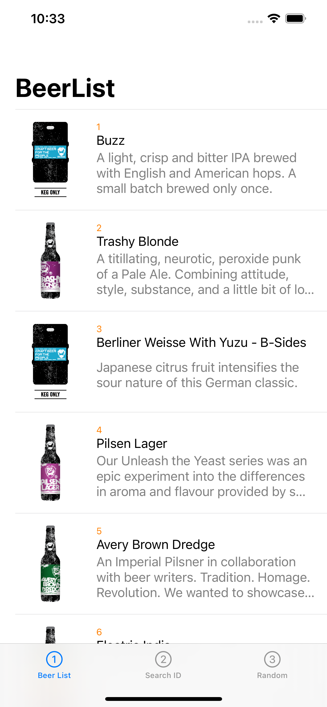
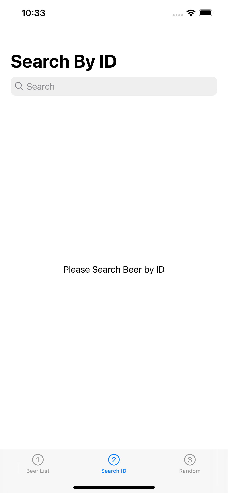
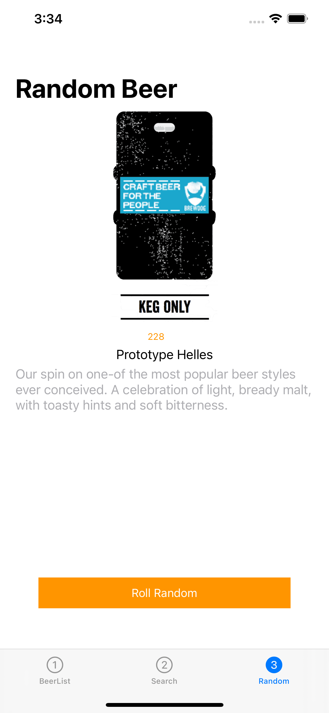

# iOS Architectures

## API

- [Beer API](https://punkapi.com/documentation/v2)


## Reference

1. Started from [Pawel Krawiec](https://github.com/tailec)'s [ios-architecture](https://github.com/tailec/ios-architecture) & [Bo-Young PARK](https://github.com/fimuxd)'s [BringMyOwnBeer-](https://github.com/fimuxd/BringMyOwnBeer-)
2. Studied MVVM+RxSwift with [Miguel Lin](https://github.com/gannasong)'s [RxSwift-MVVM-Demo](https://github.com/gannasong/RxSwift-MVVM-Demo)
3. Studied Coodinator Pattern with [wojciech-kulik](https://github.com/wojciech-kulik)'s [Swift-MVVMC-Demo](https://github.com/wojciech-kulik/Swift-MVVMC-Demo)
4. Studied Clean Architecture with [Oleh](https://github.com/kudoleh)'s [iOS-Clean-Architecture-MVVM](https://github.com/kudoleh/iOS-Clean-Architecture-MVVM)

Thank for people of this list!


## Screenshots

| List | Search | Random |
| :--: | :----: | :----: |
 |  |  |


## 0. Shared

Image Download - Kingfisher


## 1. [MVC - storyboard](https://github.com/Goeun1001/ios-architectures/tree/master/MVC-storyboard)

UI - Storyboard

Network - URLSession


## 2. [MVC - snapKit](https://github.com/Goeun1001/ios-architectures/tree/master/MVC-snapKit)

UI - SnapKit

Network - URLSession


## 3. [MVP - snapKit](https://github.com/Goeun1001/ios-architectures/tree/master/MVP-snapKit)

UI - SnapKit, Then

Network - URLSession


## 4. [MVVM - RxSwift - storyboard](https://github.com/Goeun1001/ios-architectures/tree/master/MVVM-RxSwift-storyboard)

UI - Storyboard, RxDatasource

Network - RxURLSession

Unit Tests 👌 - RxTest


## 4-1. [MVVM - RxSwift - xcodegen](https://github.com/Goeun1001/ios-architectures/tree/master/MVVM-RxSwift-xcodegen)

UI - Storyboard, RxDatasource

Network - RxURLSession

Unit Tests 👌 - RxTest

Xcodegen 👌

```
$ cd MVVM-RxSwift-xcodegen/
$ xcodegen
```


## 5. [MVVM - RxSwift - snapKit](https://github.com/Goeun1001/ios-architectures/tree/master/MVVM-RxSwift-snapKit)

UI - SnapKit, Then, RxDatasource

Network - Moya

Unit Tests 👌 - RxTest


## 5-1. [MVVM - RxSwift - coreData]

UI - SnapKit, Then, RxDatasource

Network - RxURLSession

Repositoy Pattern - CoreData

Unit Tests 👌 - RxTest, Nimble


## 5-2. [MVVM - RxSwift - realm]

UI - SnapKit, Then, RxDatasource

Network - RxURLSession

Repositoy Pattern - Realm

Unit Tests 👌 - RxTest, Nimble


## 5-2. [MVVM - RxSwift - sqlite]

UI - SnapKit, Then, RxDatasource

Network - Moya

Repositoy Pattern - Sqlite3

Unit Tests 👌 - RxTest, Nimble


### // MARK: - UNDO


## 6. ReactorKit

UI - SnapKit, Then, RxDatasource

Network - Moya

Unit Tests 👌 - RxTest, Nimble


## 7. MVVM-C + RxSwift + Moya

UI - SnapKit, Then, RxDatasource

Network - Moya

Unit Tests 👌 - RxTest, Nimble, Quick

CI - Github Actions 👌


## 8. MVVM-C + RxSwift + Moya + Swinject

UI - SnapKit, Then, RxDatasource

Network - Moya

Unit Tests 👌 - RxTest, Nimble, Quick

Xcodegen 👌

DI - Swinject


## 9. Clean Architecture with MVVM-C + RxSwift


## 10. Clean Architecture with MVVM + RxSwift + RxFlow


## 11. Clean Architecture with MVVM + RxSwift + RxFlow + Swinject


## 💕 WAITING YOUR PR for the better codes.